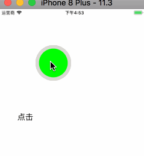

# HDLongPressButton

一个常用的长按按钮，针对[33-cameraSwitch](https://github.com/CYC666/33-cameraSwitch)进行了整理。统一了接口，进行了cocoapods管理。

## 一、导入项目

该工具可以使用cocoapods导入，也可以通过下载源文件导入。

### 通过cocoapods导入

```
pod 'HDLongPressButton'
```
### 通过文件导入

下载项目，将项目文件下的`HDLongPressButton`文件夹里面的内容导入项目即可

## 二、函数使用

### 1、导入头文件 

```
#import "HDLongPressButton.h"
```
### 2、创建和设置对象
```
HDLongPressButton *longPressBtn = [[HDLongPressButton alloc] initWithFrame:CGRectMake(100, 100, 100, 100)];
[longPressBtn setTopColor:[UIColor greenColor]];
[longPressBtn setProgressColor:[UIColor redColor]];
[self.view addSubview:longPressBtn];
    
longPressBtn.tapCompleteHandler = ^{
     NSLog(@"点击");
};

longPressBtn.startLongPressCompleteHandler = ^{
      NSLog(@"开始长按");    
};
 
longPressBtn.endLongPressCompleteHandler = ^(float longPressTime) {
      NSLog(@"结束长按");
};
    
longPressBtn.cancelLongPressCompleteHandler = ^{
      NSLog(@"取消长按");
};
```

## 三、效果演示




## 四、其他 Other

欢迎交流，互相学习

项目gitHub地址：[https://github.com/DamonHu/HDLongPressButton](https://github.com/DamonHu/HDLongPressButton)

我的博客：[http://www.hudongdong.com](http://www.hudongdong.com)
